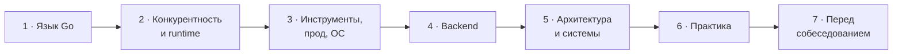

<div align="center">

# 🐹 Go Interview Roadmap

**Подготовка к собеседованию на Go backend-разработчика — от синтаксиса до system design**

Единый роадмап на 670+ вопросов, готовые ответы «как сказать на собесе», глоссарий терминов и разбор форматов собеседований в бигтехе.

[](https://go.dev/)
[](ROADMAP.md)
[](#answers)
[](#)
[](LICENSE)

[**🗺 Открыть роадмап**](ROADMAP.md) · [**✅ Ответы**](#answers) · [**📚 Глоссарий**](answers/glossary.md) · [**🏢 Бигтех**](ROADMAP.md#s7-1)

</div>

---

## 🤔 Что это

Репозиторий для тех, кто готовится к собеседованию на позицию **Middle+ / Senior Go backend-разработчика** и хочет закрыть все темы, а не только «топ-20 вопросов».

- 🗺 **Роадмап** — 7 этапов, 48 тем, 671 вопрос. Дубли объединены, у каждой темы есть ссылки, где читать, и практические задачи.
- ✅ **Ответы** — для каждого вопроса: суть за 10 секунд, как устроено внутри, ловушки и готовый текст, который можно проговорить интервьюеру. Код проверен на актуальной версии Go.
- 📚 **Глоссарий** — 40+ терминов: netpoller, G-M-P, escape analysis, write barrier и другие. В ответах термины — ссылки на него.
- 🏢 **Бигтех** — как устроены собеседования в Яндексе, Ozon, Авито, Т-Банке, VK и других компаниях, со ссылками на источники.

---

## 🚀 Быстрый старт

1. **Открой [`ROADMAP.md`](ROADMAP.md)** и начни с [этапа 1](ROADMAP.md#stage-1).
2. **Ответь на вопрос сам** — вслух или письменно. Не подглядывай.
3. **Сверься**: нажми на вопрос со значком ✅ — откроется готовый ответ. Для остальных вопросов используй ссылки 📖 рядом с темой.
4. **Закрепи практикой** из блока 🛠 под темой.
5. Отмечай `[x]`, когда можешь ответить без подсказок.

> [!TIP]
> Сделай **fork** репозитория и отмечай прогресс в своей копии — так чекбоксы станут твоим личным трекером. Удобнее всего работать в VS Code или Obsidian.

---

## 🗺 Роадмап



| Этап | Что внутри | Вопросов |
|:---:|---|:---:|
| [**1. Язык Go**](ROADMAP.md#stage-1) | типы, строки, слайсы, map, функции, интерфейсы, ошибки, дженерики, stdlib | 133 |
| [**2. Конкурентность и runtime**](ROADMAP.md#stage-2) | горутины и планировщик, каналы, sync и atomic, context, память и GC | 93 |
| [**3. Инструменты, прод, ОС**](ROADMAP.md#stage-3) | модули, тесты, observability, Linux, Docker и Kubernetes, Git | 82 |
| [**4. Backend**](ROADMAP.md#stage-4) | сети, HTTP, API, безопасность, SQL и индексы, PostgreSQL, NoSQL, кэш, брокеры | 176 |
| [**5. Архитектура и системы**](ROADMAP.md#stage-5) | SOLID, чистая архитектура, микросервисы, распределённые системы, system design | 68 |
| [**6. Практика**](ROADMAP.md#stage-6) | алгоритмы, live coding на конкурентность, code review, «что выведет код» | 87 |
| [**7. Перед собеседованием**](ROADMAP.md#stage-7) | форматы собесов в бигтехе, behavioral, резюме, переговоры | 32 |

**Обозначения в роадмапе**

| Значок | Что значит |
|:---:|---|
| ⭐ | уровень Senior — на первом проходе можно пропустить |
| ✅ | у блока есть готовые ответы, вопрос кликабельный |
| 📖 | где читать по теме |
| 🛠 | практика: задачи с тестами, кейсы |
| 🌐 | внешний источник |

---

<a id="answers"></a>
## ✅ Готовые ответы

| Блок | Тема | Вопросов | Статус |
|:---:|---|:---:|:---:|
| 1.1 | [Базовые типы и синтаксис](answers/1.1-basics.md) | 25 | ✅ |
| 1.2 | [Строки, руны, байты](answers/1.2-strings.md) | 8 | ✅ |
| 1.3 | [Массивы и слайсы](answers/1.3-slices.md) | 16 | ✅ |
| 1.4 | Map и хеш-таблицы | 16 | ⏳ |
| 1.5+ | Остальные блоки | — | ⏳ |

<details>
<summary><b>📝 Как устроен ответ — пример</b></summary>

<br>

Каждый ответ разбит на четыре части:

> **⚡ Суть** — главное определение, то, что говоришь первым.
>
> **🔧 Под капотом** — как это устроено в рантайме, памяти и компиляторе.
>
> **⚠️ Подвохи и версии Go** — классические баги и что изменилось в последних версиях.
>
> **🎤 Прямая речь** — готовый ответ на 1–2 абзаца, который можно проговорить интервьюеру.

Пример (вопрос про `new` и `make`):

```go
s := make([]int, 3, 10)        // слайс: len 3, cap 10
m := make(map[string]int, 100) // map с подсказкой размера
p := new(int)                  // *int, *p == 0

mp := new(map[string]int)
(*mp)["a"] = 1 // паника: внутри nil-map
```

Примеры кода и их вывод проверены на актуальной версии Go.

</details>

---

## 🧭 Как готовиться

**Правило глубины.** Интервьюеры проверяют не определения, а умение применять знания. Для каждой концепции ответь себе:

| # | Вопрос к себе |
|:---:|---|
| 1 | Что это — своими словами? |
| 2 | Какую проблему решает? |
| 3 | Как устроено внутри? |
| 4 | Когда применять и когда нет? |
| 5 | Какие ограничения и trade-off? |
| 6 | Пример из практики или придуманный кейс |

Не можешь ответить на пункты 2–6 — тема не закрыта.

**Советы**
- 🧠 Сначала этапы 1–2 (язык и конкурентность) — с них начинается почти любое собеседование.
- ⌨️ Алгоритмы решай параллельно с теорией, по 1–2 задачи в день, **без IDE и без запуска** — так проходят секции в бигтехе.
- 🔁 Задачи на конкурентность пиши с нуля, с `go test -race`, каждую — дважды с перерывом в несколько дней.
- 🎤 Тренируй ответы вслух: знать и уметь рассказать — разные навыки.
- 🏢 Перед собесом в конкретную компанию загляни в [таблицу форматов](ROADMAP.md#s7-1).

---

## 📂 Структура

```
.
├── README.md          ← ты здесь
├── ROADMAP.md         ← все темы и вопросы
└── answers/
    ├── glossary.md    ← глоссарий терминов
    ├── 1.1-basics.md  ← ответы по блокам
    ├── 1.2-strings.md
    └── 1.3-slices.md
```

---

## 🔗 Полезные ресурсы

| | |
|---|---|
| **Go** | [Go Spec](https://go.dev/ref/spec) · [Effective Go](https://go.dev/doc/effective_go) · [Memory Model](https://go.dev/ref/mem) · [GC Guide](https://go.dev/doc/gc-guide) · [100 Go Mistakes](https://100go.co/) |
| **Практика** | [go-interview-practice](https://github.com/RezaSi/go-interview-practice) · [go-concurrency-exercises](https://github.com/loong/go-concurrency-exercises) |
| **Алгоритмы** | [Хендбук Яндекса](https://contest.yandex.ru/tracks/algorithms) · [NeetCode](https://neetcode.io/roadmap) · [Tech Interview Handbook](https://www.techinterviewhandbook.org/) |
| **Базы данных** | [PostgreSQL docs](https://www.postgresql.org/docs/current/) · [Рогов «PostgreSQL 18 изнутри»](https://postgrespro.ru/education/books/internals) · [Use The Index, Luke](https://use-the-index-luke.com/) |
| **System design** | [system-design-primer](https://github.com/donnemartin/system-design-primer) · [DDIA](https://dataintensive.net/) |

Полный список — в разделе [«Ресурсы»](ROADMAP.md#resources) роадмапа.

---

<div align="center">

Распространяется по лицензии [MIT](LICENSE).

**Если репозиторий помог — поставь ⭐**

</div>
